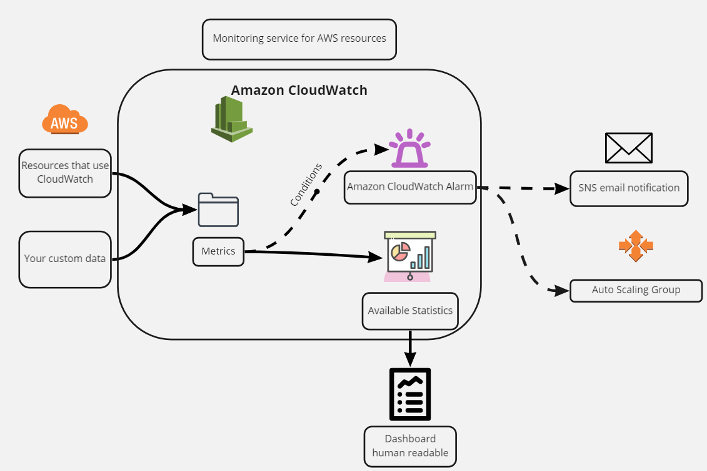

# AWS CloudWatch

## Monitoring AWS Services
1. We receive the metrics of the resources or custom data being used
2. We analysis whether the metrics trigger our conditions
    - If the thresholds are breached
        - Alarm can be triggered, if specified
            - Alarm-topic has to be created separatedly, e.g. specifying email address
        - Auto Scaling Group action/policy can be triggered
            - Policies can be created within the ASG
3. Available statistics should be available
    - At the minimum, resources metrics should be available on the instance - monitoring tab
  

