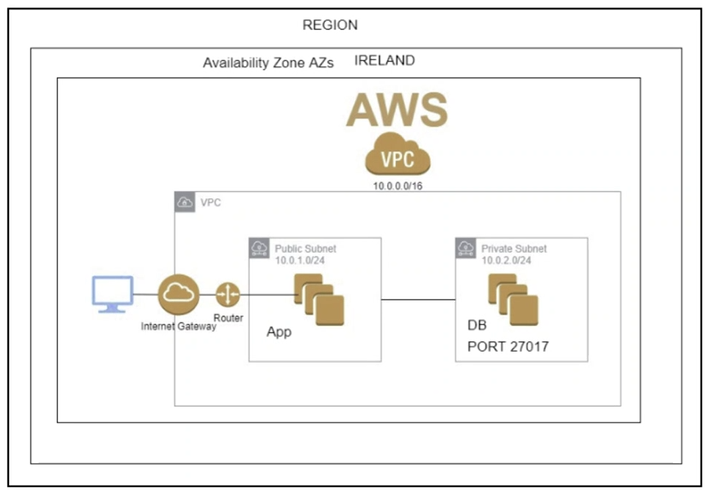
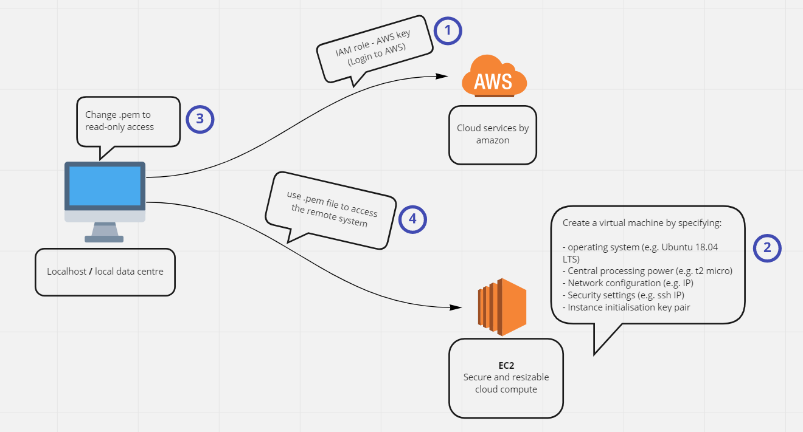
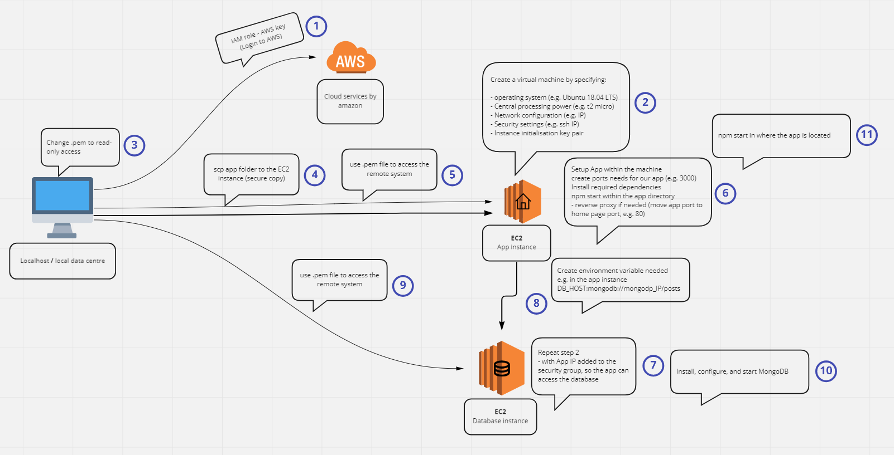

# AWS
Cloud computing service provided by amazon  
- There are over 200 services offered
- A way to move from local data center to cloud that can be accessed globally, instead of locally

## EC2
Amazon Elastic Compute Cloud is a secure and resizable cloud compute service

## Two tier architecture
- no more monolithic arch  
- We have a database (mongodb-instance) that can be read through an App-instance
    - mongoDB - 1 tier - Database
    - App - 1 tier - Frontend  

### Useful tricks
#### Make local file available on the cloud
`scp -i <.pem_path> -r <local_dir_path> <user_name>@<EC2_IP>:<dir_destination>`  
(rsaync also can be used)

### Our use - to start an locally developed app instance on the cloud
1. App
    - securely copy our app dir to the EC2 instance
    - if access denied (port 22 unavailable)
    - install nodejs with required dependencies
    - enter new ip in your security group
    - allow port 3000

    - configure nginx reverse proxy
    - ensure you could see the app home page without port 3000

2. Database
    - configure mongodb  
    - spin up a new ec2 instance in eu-west-1  
    - create a security group to allow required ports - 27017  
    - port 22  
    - inside the app instance create ENV_var DB_HOST:mongo://db-ip-add:27017/posts

    - `cd app/app/`
    - `npm start`
    - Should see localhost:3000/posts working 

    mongodb
    - install 
    - sudo systemctl start mongod
    - sudo systemctl enable mongod
    - sudo systemctl restart mongod (if needed)

## Two tier architecture dissected    

### Step 1

https://user-images.githubusercontent.com/94448528/167322237-0d731cdb-2dba-4f98-9ba3-96c54c9df7c7.mp4

### Step 2

https://user-images.githubusercontent.com/94448528/167325613-002eca3e-97b5-417b-ba2c-0dc50bd670a5.mp4

https://user-images.githubusercontent.com/94448528/167325618-a0e44c01-3bd1-4a6f-a3f3-186152b18f6e.mp4

### Step 3

https://user-images.githubusercontent.com/94448528/167325641-3f120173-044d-4418-a159-7b6a08230f16.mp4

### Step 4

https://user-images.githubusercontent.com/94448528/167325776-7d62a7cd-f026-4e56-ba5a-05929d2b0ef7.mp4

### Step 5

https://user-images.githubusercontent.com/94448528/167325882-8a51ec5a-2e3a-4506-86ff-19af454dfbda.mp4

### Step 6

https://user-images.githubusercontent.com/94448528/167326001-fb38fc86-2e89-403f-9c50-4e655501dbf2.mp4

### Step 7

https://user-images.githubusercontent.com/94448528/167326367-97512360-7a9d-41d5-91c4-03c2b868e917.mp4

https://user-images.githubusercontent.com/94448528/167326374-39ac9da5-c7d4-48af-ab0a-b6e64ab18df1.mp4

### Step 8

https://user-images.githubusercontent.com/94448528/167326524-be3934ce-05aa-4b69-b1b4-c72923d57230.mp4

### Step 9

https://user-images.githubusercontent.com/94448528/167326729-acaa4acd-fa2c-485d-8214-7cdc987aa641.mp4

### Step 10

https://user-images.githubusercontent.com/94448528/167326750-7e39ab58-7501-478f-a542-ed2bac15ba68.mp4

https://user-images.githubusercontent.com/94448528/167326822-20cc81c4-264d-42be-8a6d-6bba5aba177d.mp4

https://user-images.githubusercontent.com/94448528/167326859-c235b777-49c5-4403-bbf6-333f55d59d44.mp4

### Step 11

https://user-images.githubusercontent.com/94448528/167326943-3ea1ec2d-4f21-4b68-a8b3-f8c3bb46f87f.mp4

