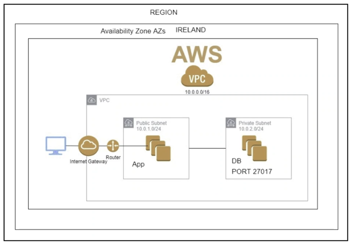
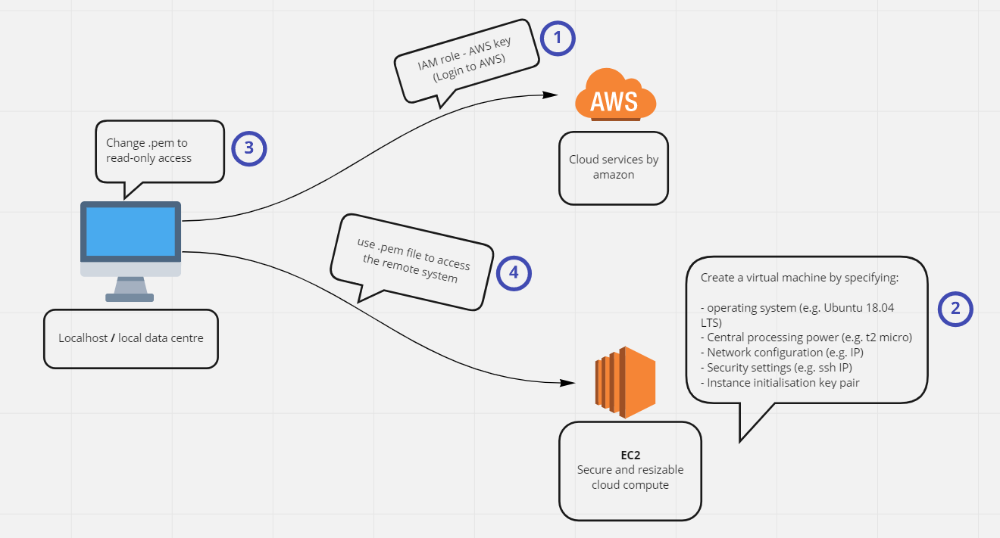
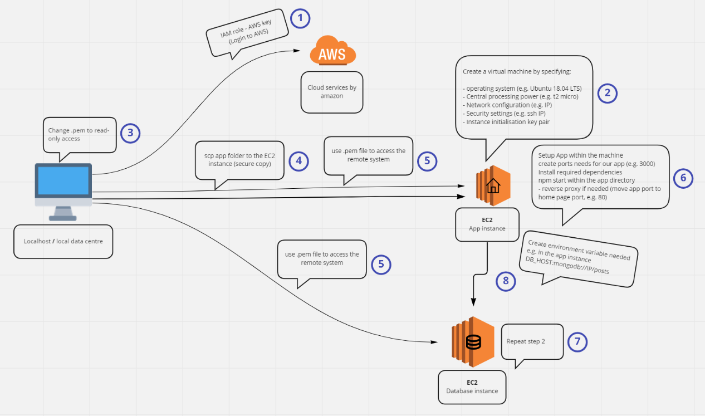

# AWS
Cloud computing service provided by amazon  
- There are over 200 services offered
- A way to move from local data center to cloud that can be accessed globally, instead of locally

## EC2
Amazon Elastic Compute Cloud is a secure and resizable cloud compute service

## Two tier architecture
- no more monolithic arch  
- We have a database (mongodb-instance) that can be read through an App-instance
    - mongoDB - 1 tier - Database
    - App - 1 tier - Frontend  

### Useful tricks
#### Make local file available on the cloud
`scp -i <.pem_path> -r <local_dir_path> <user_name>@<EC2_IP>:<dir_destination>`  
(rsaync also can be used)

### Our use - to start an locally developed app instance on the cloud
1. App
    - securely copy our app dir to the EC2 instance
    - if access denied (port 22 unavailable)
    - install nodejs with required dependencies
    - enter new ip in your security group
    - allow port 3000

    - configure nginx reverse proxy
    - ensure you could see the app home page without port 3000

2. Database
    - configure mongodb  
    - spin up a new ec2 instance in eu-west-1  
    - create a security group to allow required ports - 27017  
    - port 22  
    - inside the app instance create ENV_var DB_HOST:mongo://db-ip-add:27017/posts

    - `cd app/app/`
    - `npm start`
    - Should see localhost/posts working 

    mongodb
    - sudo systemctl start mongod
    - sudo systemctl enable mongod
    - sudo systemctl restart mongod (if needed)