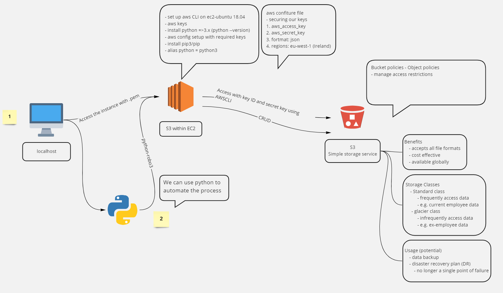

# Simple storage service  

Amazon Simple Storage Service (Amazon S3) is an object storage service that offers industry-leading scalability, data availability, security, and performance. Customers of all sizes and industries can use Amazon S3 to store and protect any amount of data for a range of use cases, such as data lakes, websites, mobile applications, backup and restore, archive, enterprise applications, IoT devices, and big data analytics. Amazon S3 provides management features so that you can optimize, organize, and configure access to your data to meet your specific business, organizational, and compliance requirements.  

## Our first use case  

### S3 setup
command | function
--- | ---
`sudo apt install python` | install python
`sudo apt install python3-pip -y` | install python 3.x (specifically), if the previous installs python < 3.x
`alias python=python3` | instruct the system to use python 3
`python --version` | ensure we have python > 3.x
` `| to make it permanent - make it an env var
`sudo python3 -m pip install awscli` | install awscli
`aws configure` | input configs - securing our keys as now they are stored in the aws cloud
`aws s3` | to use s3
`aws s3 ls` | tell s3 to list the contents (to know we have secured and inputted our keys correctly)
`aws s3 mb s3://eng110-anson` | make a s3 bucket - name can only contain [^a-zA-Z0-9_]
`aws s3 cp <file_path> s3://<bucket_name>/` | copying file from ec2 to s3

### Interaction with s3
command | function
--- | ---
`aws s3 cp s3://<bucket_name>/<file_name> .` | transfer data from s3 to ec2