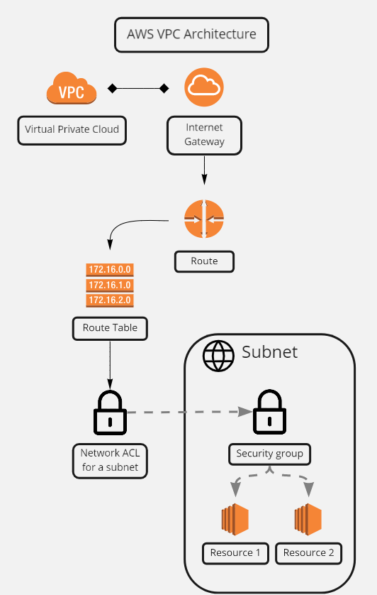

# AWS Virtual Private Cloud
VPC is a private network that works as a flatform for us to launch AWS resources to. The functionalities resembles a traditional network that we would operate in our own data center.  

### Basic VPC atchitecture example:

1. VPC setup guide [here](#vpc-setup-guide)
2. Glossary [here](#glossary)  

## VPC Setup Guide

We now should attach the internet gateway to the VPC  

We then create a subnet  

Now we set up the route table for routing the internet  

Connet the route table to the subnet target (internet gateway)  

## Private Subnet

## Glossary

### Internet Gateway
Internet gateway is a VPC component that allows communication between a VPC and the internet. It provide the option to transfer data between the internet and the VPC subnets. In AWS, resources, such as an EC2 instance, stored in a subnet can be accessed through the internet, if access is enabled. For example, we access the EC2 instance on our local machines using internet gateway. On the other hand, AWS resources use internet gateway to access the internet, for example updating EC2 instance packages.
https://docs.aws.amazon.com/vpc/latest/userguide/VPC_Internet_Gateway.html  

### Route Table
A route table contains a set of rules, called routes, that determine where network traffic from our subnet or gateway is directed. For example, we can make a subnet a public subnet by adding a route in our subnet route table to an internet gateway.

To do this, create and attach an internet gateway to your VPC, and then add a route with a destination of 0.0.0.0/0 for IPv4 traffic or ::/0 for IPv6 traffic, and a target of the internet gateway ID (igw-xxxxxxxxxxxxxxxxx).  

An intuitive example can be traffic lights we have on the roads.  
https://docs.aws.amazon.com/vpc/latest/userguide/VPC_Route_Tables.html  
https://docs.aws.amazon.com/vpc/latest/userguide/route-table-options.html  

### Subnet
Subnet is a range of IP addresses in the VPC. We can launch AWS resources, such as EC2 instances, into a specified subnet. When we create a subnet, we specify the IPv4 CIDR block for the subnet. Each subnet must reside entirely within one AZ. By launch instances in separate AZs, we can protect our services from the failure of a single zone.  
https://docs.aws.amazon.com/vpc/latest/userguide/configure-subnets.html  

Subnet builder here: https://tidalmigrations.com/subnet-builder/  

### CIDR Block
Classless Inter-Domain Routing (CIDR) is a method for allocating IP addresses and routing Internet Protocol packets.

Classless Inter-Domain Routing blocks are groups of addresses that share the same prefix and contain the same number of bits. The combination of multiple connecting CIDR blocks into a larger whole, sharing a common network prefix, is what constitutes supernetting. 

For example, for 217.10.138.128, each of the [217, 10, 138, 128] is a CIDR Block.  
  
https://www.techtarget.com/searchnetworking/definition/CIDR#:~:text=CIDR%20blocks%20are%20groups%20of,the%20length%20of%20the%20prefix.  

### Sub-Mask
Each network, by default, has only one subnet, which contains all of the host addresses defined within. A netmask is basically a specification of the amount of address bits that are used for the network portion. A subnet mask is another netmask within used to further divide the network.  
https://www.bogotobogo.com/DevOps/AWS/aws-VPC-Virtual-Private-Cloud-1-netmast-subnet-default-gateway-CIDR.php  

### IP-Networking
An IP network refers to any group of devices, each with their own unique IP addresses, connected under the same network topology. Devices connected to a shared IP network can send and receive information. 

A private IP network allows data to be shared between connected devices securely, by enforcing password protected connectivity that allows only those devices in your office or home to access the IP network.  
https://www.ringcentral.co.uk/gb/en/blog/definitions/ip-network/  

### NACL
Security group works as a firewall on an instance level. Network access control list (NACL) works as a security group on an subnet level that manage the security rule applied to all instances, and within each instance, they can have their separate security group. 

An intuitive example can be that NACL works as the stadium security that checks audiences' tickets, and security group works as the second layer check at different sections within the stadium, e.g. media booth, player section, VIP section.  
https://docs.aws.amazon.com/vpc/latest/userguide/vpc-network-acls.html
