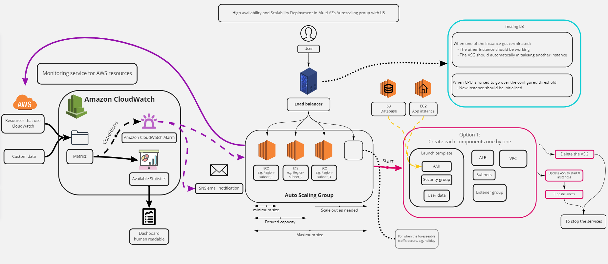

## What is cloud computing?  
On-demand availability of easily configurable computer system resources upon user requests that are accessible through the internet

This repo contains guides to have high availability and scalbility deployment in AWS

- AWS Elastic Cloud Compute guide: [AWS-EC2-guide.md](AWS-EC2-guide.md)
- AWS Simple Storage Service guide: [AWS-S3-guide.md](AWS-S3-guide.md)
- AZs Deployment guide: [AZs-deployment-guide.md](AZs-deployment-guide.md)
- AWS CloudWatch guide: [AWS-CloudWatch-guide.md](AWS-CloudWatch-guide.md)  
- AWS VPC guide: [AWS-VPC-guide.md](AWS-VPC-guide.md)

## Benefits

- Cost effectiveness
    - Capital expenditures (CapEx)
    - Operating expenditures (OpEx)
        - Pay as you go
        - Payments are charged on the space rented
- Accessibility
    - Going up in minutes 
    - Accessible anywhere through internet
    - More consistent & stable uptime
- Flexibility
    - Different operating systems
    - Linux
    - Infrastructure as code
- Stability
    - Having multiple data centers
    - Disaster recovery plan      
- Security
    - Private
        - Only available to the organisation rented the space
        - e.g. GovCloud is only available for government departments
    - Public
        - Cloud services for the public
    - Hybrid
        - A mix of private and public
        - e.g. Bank 
            - Passwords and bank details should be private, maybe stored in their own data centers
            - Public cloud services can contain publicly accessible information
        
## Example
- Google Cloud 
- IBM Cloud
- AWS
- Azure

## Region
- Physical data center area
- Including multiple availability zones
    - Why multiple?
        - Facilitate stability on maintaining constant runtime
        - e.g. If one data center is down, requests will be redirected to other running data centers
- Allow businesses to choose a space that is closest to the end users

## Data centers
- Core and brain of the internet
- Where the computing hardwares are stored and run from
- Immense focus on security
    - Strict access restrictions
    - Various security levels, depending on the sensitivity of the information being stored or run on the computing units
    
